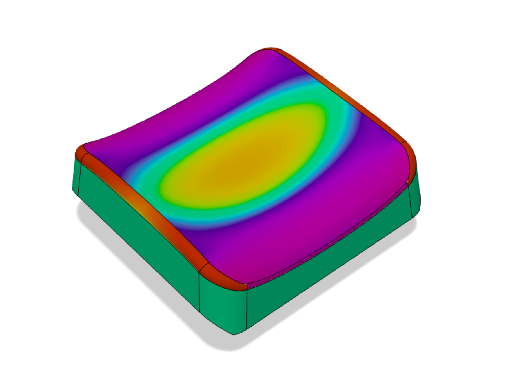
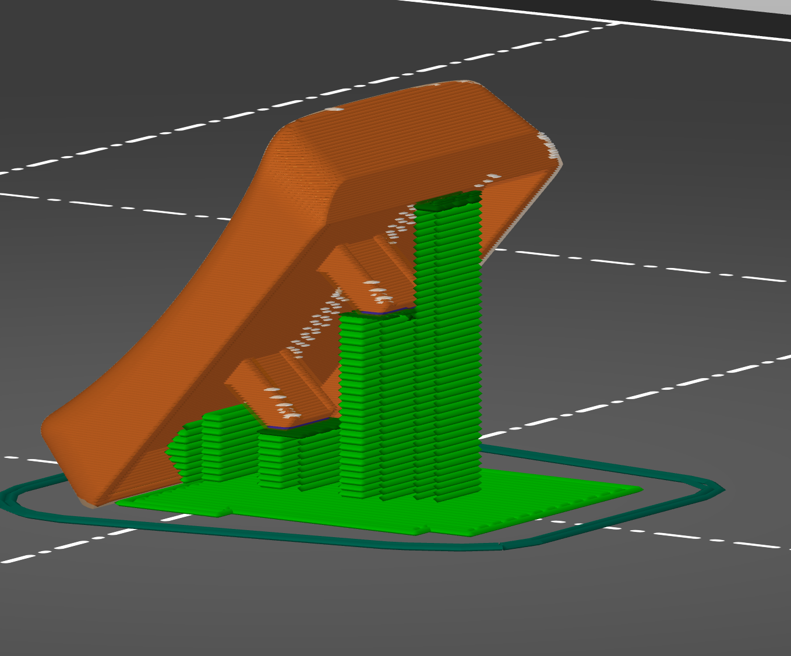

# LPX Keycap - compact, FDM optimized ergo choc design

## Overview

LPX is a brand new low profile keycap, optimized to be compact, comfortable, and easy to manufacture. Some highlights:
* **Choc stem** for low profile switches

* **Compact** without sacrificing touch surface area. 18% smaller footprint than MBK while maintaining same finger contact surface. Allows for more ergonomic keywell designs with tighter key spacing. Minimizes finger movement while leaving enough room to prevent accidentally hitting adjacent keys.

* **Contoured saddle** top surface. These feel similar to Chicago Steno, with a slight valley in the middle gently hugging your finger pad. Improved feel compared to spherical MBK and cylindrical scooped choc. 

* **FDM optimized** to make it easy to produce in small batches in a variety of colors/finishes.

## FDM Printing Guide

FDM printers are not amazing at tiny details, but with a few tweaks you can get very good results for keycaps. This is a guide to get the most out of your prints - it’s written as a how-to for printing LPX caps, but most things will apply to printing any cap design.

### Part orientation
If you’ve tried printing a cap, you already know that the best thing you can do to improve top surface quality is to rotate the cap vertically so that you get extra resolution along the Z-axis. The optimal vertical angle is around 45deg to balance between the quality of the top surface and the sides.

Choosing which side to place on the bottom of the build plate is also important. You want the keycap to be extra smooth in the direction of the finger travel, which means you should align the layer lines with the front-back direction of the cap. In other words, you want the left or the right edge of the cap to be on the build plate, not front/back. 

Finally, you will *also* want to rotate the model in the XY plane.  Your top priority here is to get good cooling on your top surface so orient it to have your printer fan blow directly on it. If your printer is good at cooling in all directions, consider turning your part 45deg in XY plane - this will automatically slow down your X and Y print motors by 1.41 (square root of two). 

### Anchoring
Once your model is oriented, the new challenge is keeping it attached to the build plate while printing. LPX has some design-level accommodations here. 
First, the left and ride edges are chamfered at 45deg, giving you a nice flat surface to put on the build plate. Further the stem tips are also slightly trimmed at 45deg to give supports a better surface to grab onto.

Depending on your printer and filament you will probably want yet another anchor to keep everything extra stable. Adding a paint-on support to the stem-side surface of the cap will help a lot. 

Note: avoid adding a brim or a raft - they will ruin the look of the side of the cap. 

### Supports and Z-Seam placement
Because of the orientation of the cap, you will need to support the stems, as well as the top of the cap. Depending on how good your printer cooling is you can get away with a pretty long bridge at the top of the cap with minimal supports (to keep the surface edge looking clean).

Fortunately we have one surface (stem-side, bottom) where we do not care about visual quality so make sure to place your Z-seam there. 

### Layer Height
Surprisingly this is not as critical as it might seem. You can get very good results even with .15mm layers especially if you are using a glitter-filled filament that hides layers well. 0.1mm is probably the best compromise between layer quality and ease of printing, but you can go even lower if your printer is tuned especially well.

### Perimeters and Infill
At low layer heights, you need a *lot* of perimeters to prevent infill punching through to the outside surface and ruining the finish. LPX is designed to not require any infill at all (set to 0), and be printable with either 1 or 2 perimeters (there are some tradeoffs between speed and quality on printers with leaky extruders).

If you are working with a design that requires infill, try reducing infill-perimeter overlap % in your settings. 

Similar to infill you will want to eliminate solid top-surface support layers. This can be done by setting top+bottom solid layers to 0 in your slicer settings. (Note: you still want your very first layer on the build plate to be solid, so tweak your setting to make sure it’s there. In PrusaSlicer this can be done with a layer height modifier). 

### Speed
The slower you are printing, the better your surface quality will be. Slowing perimeters down to 20 or even 10mm/s can help here. Slowing down non-printing travel speed can help a bit as well to reduce vibration, but it can also make stringing worse if your printer is not tuned perfectly. 

### All the usual printer things
You already know this, but worth repeating. Level your bed. Adjust Z-height. Put your printer on a heavy base to reduce vibration. Clean the nozzle. Dry your filament. Tune temperature and retraction to minimize stringing. Make sure your cooling fan is working well, or add another fan to improve cooling.

### Post-processing
With a nice glittery filament you can make the caps look flawless from a normal distance (yes you’ll still see layers on a zoomed in macro shot, but it doesn’t really matter). However they will not feel as smooth as injection-molded plastic caps. Coating the tops with a thin layer of epoxy or even just clear nail polish works really well and takes only a few minutes to do.

If you want to go all out, try printing in ABS and smooth your prints with acetone (will update this guide once I try it for LPX). 

### Things that do not matter
Finally, it’s also worth calling out things that do not improve your print quality but will slow things down needlessly. 
* I did not see any improvements with a nozzle smaller than stock .4mm. This makes sense since a smaller nozzle only helps with XY resolution, and there is already plenty. 
* Extra perimeters. Even 1 perimeter looks good. 2 might be a tiny bit better, but really hard to tell the difference. 
* 100% Infill. This slows you down and makes the surface look worse. 

